# Alimiyya Bayazan - Quranic Study Workbook Generator

**Languages:** [English](README.md) | [اردو (Urdu)](README.ur.md)

A Python-based tool for generating comprehensive Quranic study workbooks (Bayazan) designed for Alimiyya Islamic education courses. The system creates beautifully formatted Microsoft Word documents with word-by-word Arabic analysis, morphological data, and space for student notes.

## 📥 Download Pre-Generated Workbooks

**Don't want to run Python scripts?** Download ready-to-use workbooks:

👉 **[Latest Release](https://github.com/mohammedzee1000/alimiyya-bayazan/releases/latest)**

Download instructions:
1. Open the latest release page.
2. Scroll down to the **Assets** section.
3. Download the `.zip` file for Windows or the `.tar.gz` file for Linux/macOS.

### Available Downloads:
- **Standard Mode** (2-column layout)
  - `alimiyya-bayazan-standard-v1.0.0.tar.gz` (Linux/macOS)
  - `alimiyya-bayazan-standard-v1.0.0.zip` (Windows)

- **Pro Mode - Indo-Pak** (4-column with morphology)
  - `alimiyya-bayazan-pro-indopak-v1.0.0.tar.gz` (Linux/macOS)
  - `alimiyya-bayazan-pro-indopak-v1.0.0.zip` (Windows)

- **Pro Mode - Uthmani** (4-column with morphology)
  - `alimiyya-bayazan-pro-uthmani-v1.0.0.tar.gz` (Linux/macOS)
  - `alimiyya-bayazan-pro-uthmani-v1.0.0.zip` (Windows)

Each archive contains all 25 volumes covering the entire Quran, plus fonts and setup instructions.

> **📖 After downloading:** See [`USAGE_INSTRUCTIONS.md`](USAGE_INSTRUCTIONS.md) included in the archive, or [view online](https://github.com/mohammedzee1000/alimiyya-bayazan/blob/main/USAGE_INSTRUCTIONS.md)

---

## 💻 For Developers: Generate Your Own Workbooks

## 🌟 Features

- **Word-by-Word Analysis**: Each Quranic word presented in structured table format
- **Morphological Integration**: Automatic root extraction from Quranic Corpus databases
- **Color-Coded Grammar**: Visual distinction between nouns (blue), verbs (red), and particles (grey)
- **Dual Generation Modes**:
  - **Standard Mode**: 2-column layout with basic word analysis
  - **Pro Academic Mode**: 4-column layout with advanced morphological features and theme support
- **Theme Support**: Indo-Pak Nastaleeq and Uthmani scripts (Pro mode)
- **Batch Processing**: Generate all 25 volumes covering the entire Quran with a single command
- **Professional Typography**: Optimized Arabic fonts with full tashkeel support

## 📸 Screenshots

### Standard Mode
<table>
  <tr>
    <td>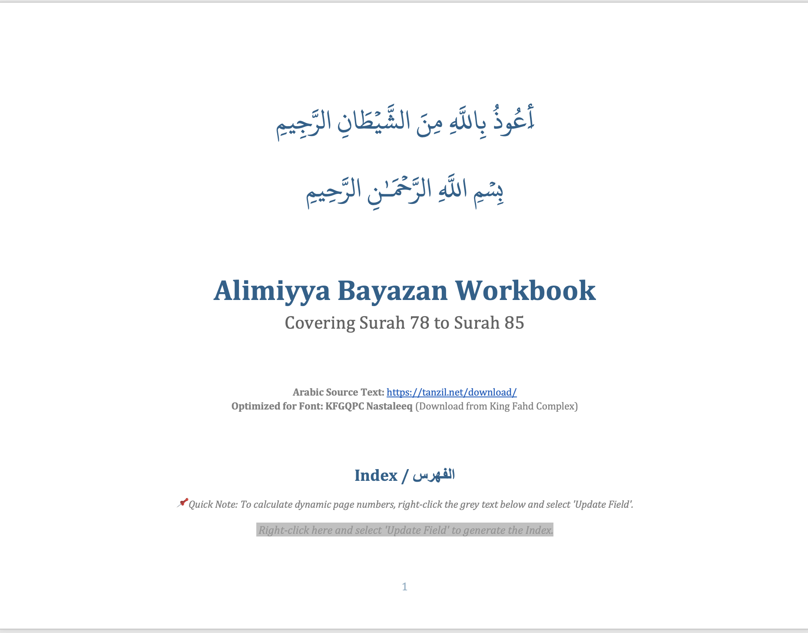<br/><b>Cover Page</b></td>
    <td>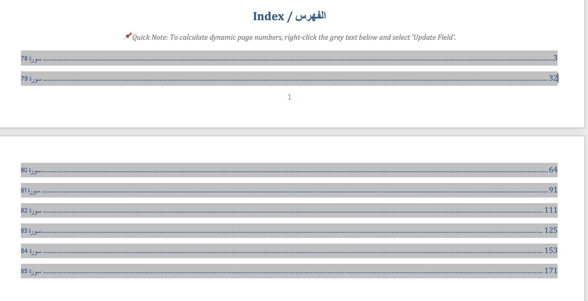<br/><b>Table of Contents</b></td>
  </tr>
  <tr>
    <td>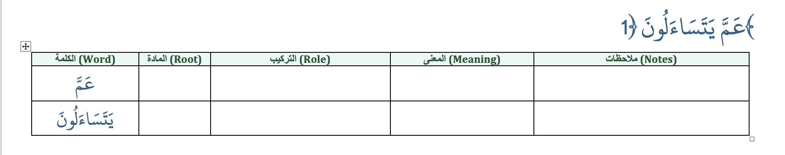<br/><b>Word Analysis Table</b></td>
    <td>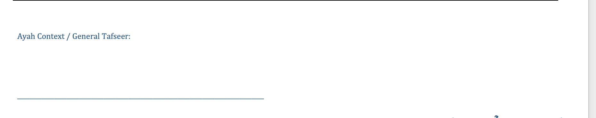<br/><b>Ayah Notes Section</b></td>
  </tr>
</table>

### Pro Indo-Pak Mode
<table>
  <tr>
    <td>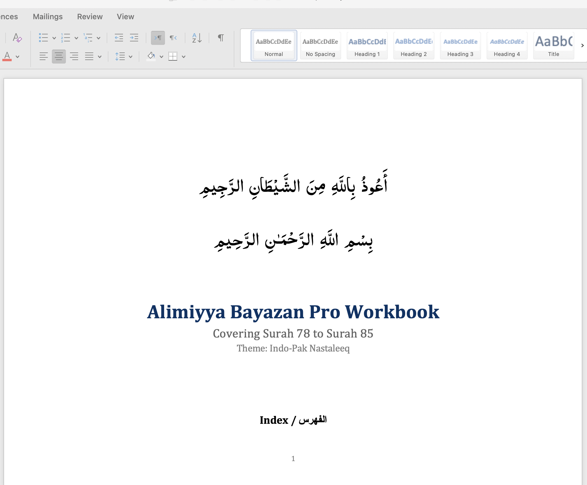<br/><b>Cover Page</b></td>
    <td>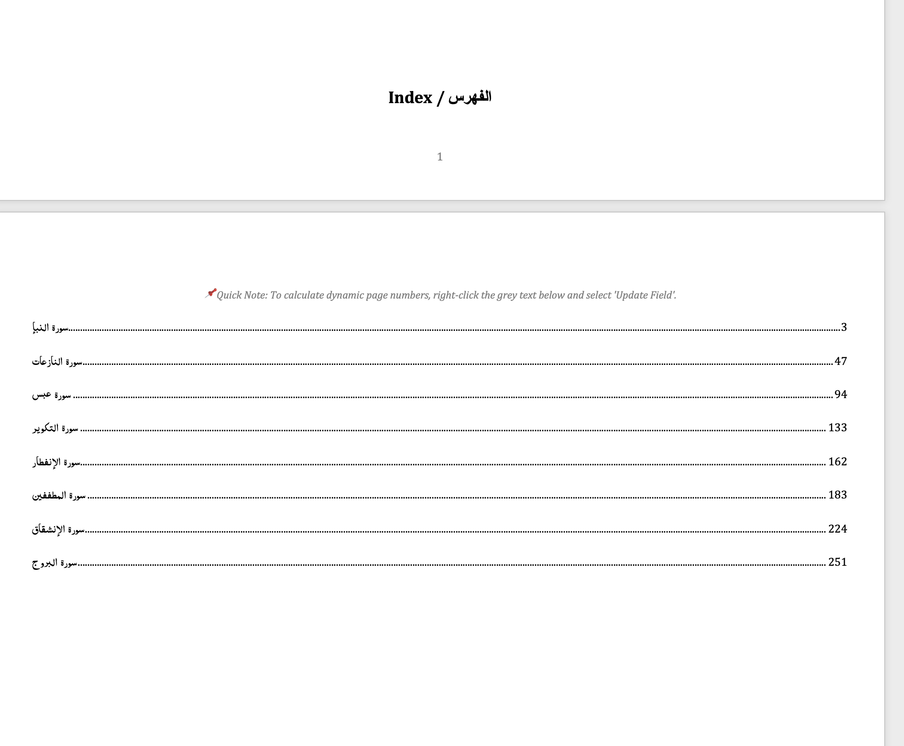<br/><b>Table of Contents</b></td>
  </tr>
  <tr>
    <td>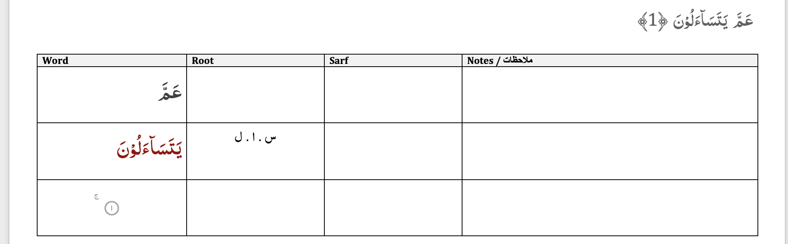<br/><b>4-Column Analysis</b></td>
    <td>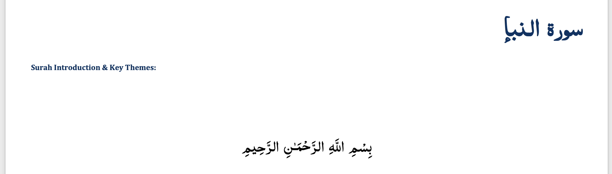<br/><b>Surah Header with Juz</b></td>
  </tr>
</table>

### Pro Uthmani Mode
<table>
  <tr>
    <td>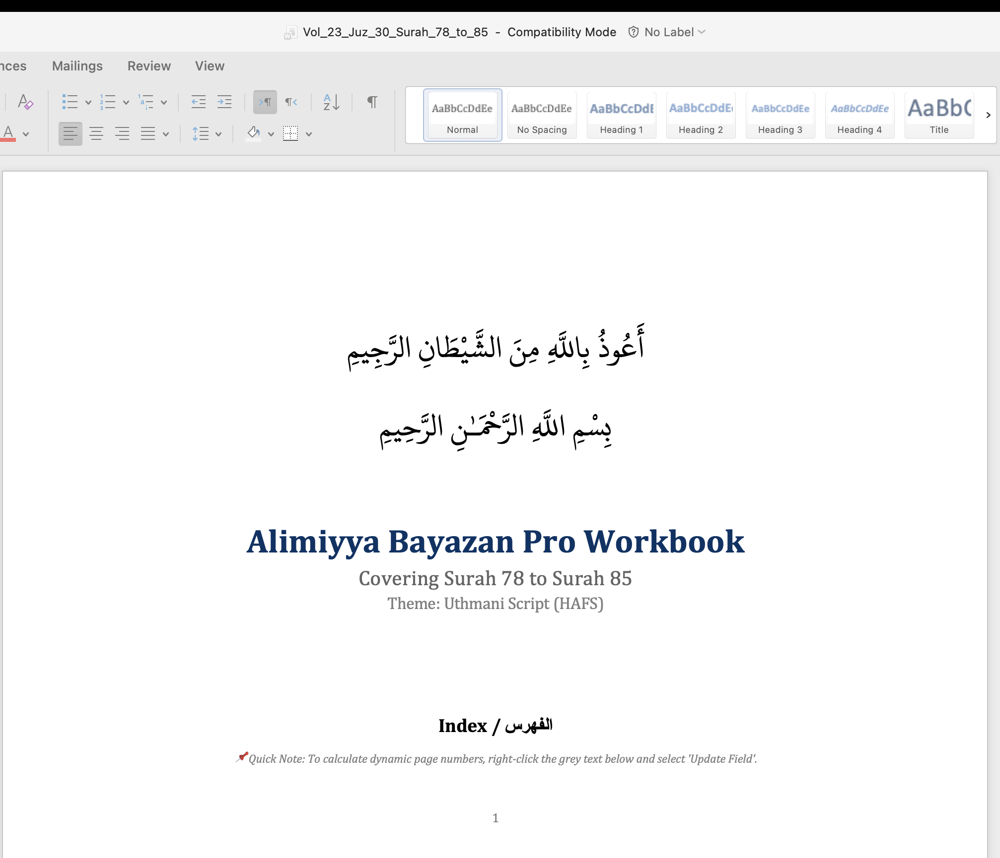<br/><b>Cover Page</b></td>
    <td>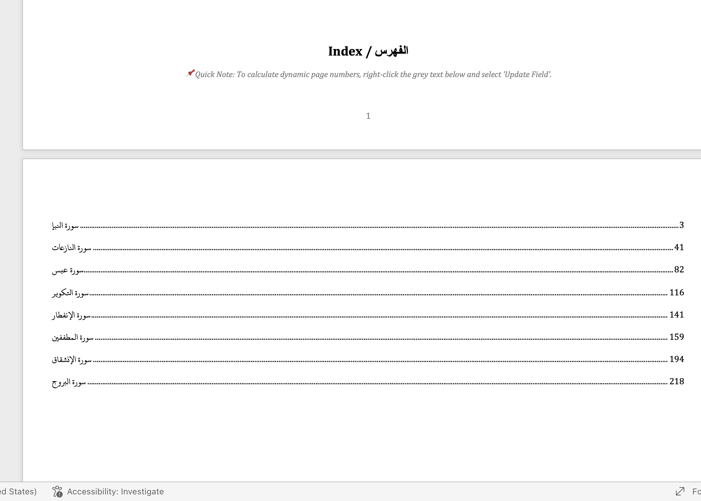<br/><b>Table of Contents</b></td>
  </tr>
  <tr>
    <td colspan="2">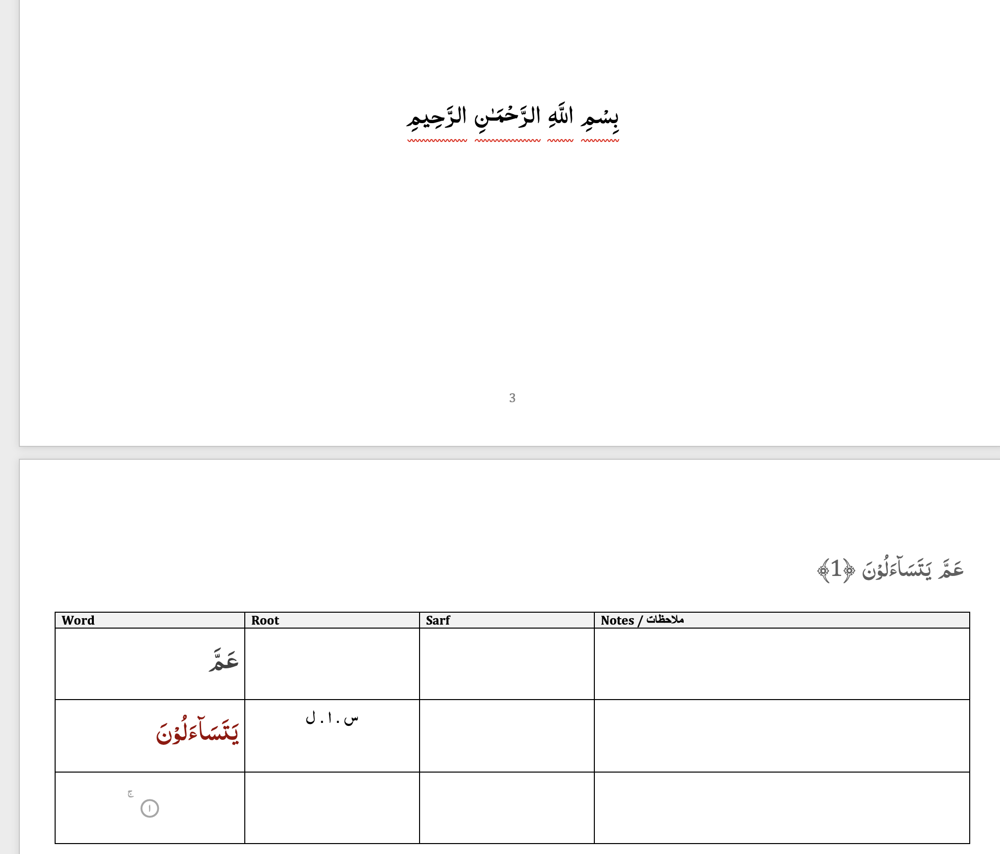<br/><b>Uthmani Script Analysis</b></td>
  </tr>
</table>

## 📋 Prerequisites

- **Python**: 3.7 or higher
- **Operating System**: macOS, Linux, or Windows
- **Microsoft Word**: For viewing and editing generated documents

## ⚠️ Important: Font Installation Required

**The generated workbooks require specific Arabic fonts to display correctly.** Without installing these fonts, the Arabic text will appear in a generic font (Arial/Times New Roman) instead of the beautiful Indo-Pak Nastaleeq or Uthmani scripts.

### Installing Fonts:

1. **Locate the font file** in the `generated/` directory:
   - Standard mode: `AlQuran IndoPak by QuranWBW.ttf`
   - Pro Indo-Pak mode: `AlQuran IndoPak by QuranWBW.ttf`
   - Pro Uthmani mode: `KFGQPC Uthmanic Script HAFS.otf`

2. **Install the font**:
   - **Windows**: Right-click the `.ttf` file → "Install"
   - **macOS**: Double-click the `.ttf` file → Click "Install Font"
   - **Linux**: Copy to `~/.fonts/` or `/usr/share/fonts/` then run `fc-cache -f -v`

3. **Close Microsoft Word completely** if it's currently open

4. **Restart Microsoft Word** - This is critical for fonts to load properly

5. **Reopen the workbook** - Arabic text should now display in the correct script

**Note**: Font files are automatically included in all generated archives and the `generated/` directory.

## 🚀 Quick Start

### 1. Clone and Setup
```bash
git clone https://github.com/yourusername/alimiyya-bayazan.git
cd alimiyya-bayazan
python3 -m venv venv
source venv/bin/activate  # On Windows: venv\Scripts\activate
pip install -r requirements.txt
```

### 2. Download Data Sources
See [`DATA_SOURCES.md`](DATA_SOURCES.md) for all required downloads and setup instructions.

### 3. Generate Workbooks

**Standard Mode (2-column):**
```bash
python generate_bayazan.py --start 1 --end 2 -o "My_Workbook.docx"
```

**Pro Academic Mode (4-column with themes):**
```bash
# Indo-Pak theme (default)
python generate_bayazan_pro.py --start 78 --end 114 --theme indopak -o "Juz_30_IndoPak.docx"

# Uthmani theme
python generate_bayazan_pro.py --start 78 --end 114 --theme uthmani -o "Juz_30_Uthmani.docx"
```

**Batch Generation (All 25 Volumes):**
```bash
# Standard mode
bash gen_bayzan_all.sh

# Pro mode with Indo-Pak theme
bash gen_bayzan_all.sh --pro

# Pro mode with Uthmani theme
bash gen_bayzan_all.sh --pro --theme=uthmani
```

## 📖 Command-Line Arguments

### Standard Mode (`generate_bayazan.py`)
| Argument | Required | Description |
|----------|----------|-------------|
| `--start` | Yes | Starting Surah number (1-114) |
| `--end` | Yes | Ending Surah number (1-114) |
| `-o, --output` | No | Custom output filename |

### Pro Academic Mode (`generate_bayazan_pro.py`)
| Argument | Required | Description |
|----------|----------|-------------|
| `--start` | Yes | Starting Surah number (1-114) |
| `--end` | Yes | Ending Surah number (1-114) |
| `--theme` | No | Theme: `indopak` or `uthmani` (default: `indopak`) |
| `-o, --output` | No | Custom output filename |

## 🎨 Available Themes

| Theme | Description | Status |
|-------|-------------|--------|
| **indopak** | Traditional Indo-Pak Nastaleeq script | ✅ Available |
| **uthmani** | Classical Uthmani script (HAFS) | ✅ Available |

## 📁 Project Structure

```
alimiyya-bayazan/
├── generate_bayazan.py          # Standard 2-column generator
├── generate_bayazan_pro.py      # Pro 4-column generator with themes
├── config.py                    # Configuration (paths, colors, themes)
├── gen_bayzan_all.sh           # Batch generation script
├── requirements.txt             # Python dependencies
├── sources/                    # Data sources (see DATA_SOURCES.md)
│   ├── shared/                 # Shared resources (metadata, morphology)
│   ├── themes/                 # Theme-specific resources
│   │   ├── indopak/           # Indo-Pak Nastaleeq
│   │   └── uthmani/           # Uthmani script
│   └── standard/              # Standard mode resources
└── generated/                  # Output directory (auto-created)
```

## 🗄️ Data Sources

This project uses academically verified Islamic resources from:
- **[QUL Tarteel](https://qul.tarteel.ai/)** - Morphology databases, scripts, and fonts
- **[Tanzil.net](https://tanzil.net/)** - Quranic text and metadata
- **[Quranic Arabic Corpus](http://corpus.quran.com/)** (University of Leeds) - Part-of-speech tagging
- **[King Fahd Complex](https://fonts.qurancomplex.gov.sa/)** - Arabic typography

**For complete setup instructions, download links, and database schemas, see: [`DATA_SOURCES.md`](DATA_SOURCES.md)**

## ⚙️ Configuration

Edit [`config.py`](config.py) to customize:

**Paths:**
```python
PATHS = {
    "shared": {...},      # Metadata and morphology
    "standard": {...},    # Standard mode resources
    "output_dir": "generated"
}
```

**Color Scheme:**
```python
COLORS = {
    "NOUN": (0, 51, 102),      # Deep Blue
    "VERB": (153, 0, 0),       # Deep Red
    "PARTICLE": (64, 64, 64),  # Dark Grey
}
```

**Themes:**
```python
THEMES = {
    "indopak": {...},
    "uthmani": {...}
}
```

## 🎨 Output Formats

**Standard Mode:**
- 5-column table: Word | Root | Role | Meaning | Notes
- Surah introductions with note space
- Ayah context sections
- Dynamic Table of Contents

**Pro Academic Mode:**
- 4-column table: Word | Root | Sarf | Notes
- Dynamic Table of Contents
- Color-coded grammatical categories
- Juz indicators
- Surah-level notes sections
- Enhanced morphological data
- Theme-specific fonts and scripts

## 🤝 Contributing

Contributions welcome! Areas for contribution:
- Additional output formats (PDF, HTML)
- Translation integration
- Enhanced tafseer sections
- Web interface

## 📄 License

MIT License - see the [LICENSE](LICENSE) file for details.

## 🙏 Acknowledgments

Built entirely on freely available, academically verified Islamic resources. Deep gratitude to:
- **Tanzil.net** - Verified Quranic text
- **Quranic Arabic Corpus** (University of Leeds, Kais Dukes) - Morphological analysis
- **QUL Tarteel** - Linguistic databases and fonts
- **King Fahd Complex** - Arabic typography
- **Alimiyya Islamic Education Program** - Pedagogical inspiration

## 📞 Support

- Open an issue on GitHub
- Contact the maintainer

---

**Note**: This tool is designed for educational purposes to facilitate Quranic study. Ensure you have the necessary data sources and fonts installed before use.